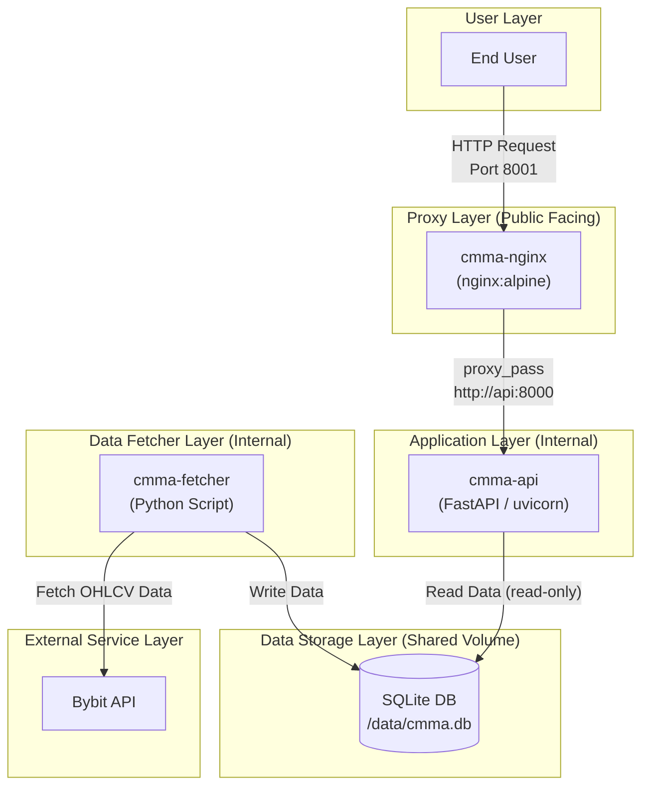

<!-- START doctoc generated TOC please keep comment here to allow auto update -->
<!-- DON'T EDIT THIS SECTION, INSTEAD RE-RUN doctoc TO UPDATE -->
**Table of Contents**  *generated with [DocToc](https://github.com/thlorenz/doctoc)*

- [cmma (crypto market metrics api)](#cmma-crypto-market-metrics-api)
  - [機能](#%E6%A9%9F%E8%83%BD)
  - [必要要件](#%E5%BF%85%E8%A6%81%E8%A6%81%E4%BB%B6)
  - [実行方法](#%E5%AE%9F%E8%A1%8C%E6%96%B9%E6%B3%95)
  - [API利用方法](#api%E5%88%A9%E7%94%A8%E6%96%B9%E6%B3%95)
    - [APIドキュメント (Swagger UI)](#api%E3%83%89%E3%82%AD%E3%83%A5%E3%83%A1%E3%83%B3%E3%83%88-swagger-ui)
    - [エンドポイント: `GET /volatility`](#%E3%82%A8%E3%83%B3%E3%83%89%E3%83%9D%E3%82%A4%E3%83%B3%E3%83%88-get-volatility)
      - [クエリパラメータ](#%E3%82%AF%E3%82%A8%E3%83%AA%E3%83%91%E3%83%A9%E3%83%A1%E3%83%BC%E3%82%BF)
      - [使用例 (curl)](#%E4%BD%BF%E7%94%A8%E4%BE%8B-curl)
      - [成功レスポンスの例](#%E6%88%90%E5%8A%9F%E3%83%AC%E3%82%B9%E3%83%9D%E3%83%B3%E3%82%B9%E3%81%AE%E4%BE%8B)
    - [エンドポイント: `GET /volume`](#%E3%82%A8%E3%83%B3%E3%83%89%E3%83%9D%E3%82%A4%E3%83%B3%E3%83%88-get-volume)
      - [クエリパラメータ](#%E3%82%AF%E3%82%A8%E3%83%AA%E3%83%91%E3%83%A9%E3%83%A1%E3%83%BC%E3%82%BF-1)
      - [使用例 (curl)](#%E4%BD%BF%E7%94%A8%E4%BE%8B-curl-1)
      - [成功レスポンスの例](#%E6%88%90%E5%8A%9F%E3%83%AC%E3%82%B9%E3%83%9D%E3%83%B3%E3%82%B9%E3%81%AE%E4%BE%8B-1)
      - [注意事項](#%E6%B3%A8%E6%84%8F%E4%BA%8B%E9%A0%85)
    - [エラーレスポンス](#%E3%82%A8%E3%83%A9%E3%83%BC%E3%83%AC%E3%82%B9%E3%83%9D%E3%83%B3%E3%82%B9)
  - [アプリケーションの停止](#%E3%82%A2%E3%83%97%E3%83%AA%E3%82%B1%E3%83%BC%E3%82%B7%E3%83%A7%E3%83%B3%E3%81%AE%E5%81%9C%E6%AD%A2)
  - [システム構成](#%E3%82%B7%E3%82%B9%E3%83%86%E3%83%A0%E6%A7%8B%E6%88%90)
    - [データフロー](#%E3%83%87%E3%83%BC%E3%82%BF%E3%83%95%E3%83%AD%E3%83%BC)
    - [Mermaid ダイアグラム](#mermaid-%E3%83%80%E3%82%A4%E3%82%A2%E3%82%B0%E3%83%A9%E3%83%A0)

<!-- END doctoc generated TOC please keep comment here to allow auto update -->

# cmma (crypto market metrics api)

Bybitの全USDT無期限契約ペアのOHLCVデータを定期的に収集し、指定した条件に基づいて価格変動率の高い銘柄を問い合わせできるAPIサーバーです。
現状FR金利の極端な偏りを抽出もAPI化検討していますがFR金利の場合はAPI Limit制限問題で別IP(NAT)から建てれた方が良いかもしれないというのもあり、現状はOHLCVデータの収集とAPI提供に特化しています。  

## 機能

- **データ収集 (Fetcher)**:
  - `.env`ファイルで指定されたタイムフレームに基づき、BybitからOHLCVデータを非同期で高速に取得します。
  - 取得したデータは、`./data`ディレクトリ内のSQLiteデータベース (`cmma.db`) に保存されます。
  - デフォルトでは5分ごとにデータを更新します。
  - **注意事項**: Bybit APIのレートリミットは、IPアドレスごとに5秒間に600件のリクエストです。(`CONCURRENCY_LIMIT` 設定の参考にしてください)
    - [Rate Limit Rules | Bybit API Documentation](https://bybit-exchange.github.io/docs/v5/rate-limit)
    - デフォルトの`.env.example`設定では、`CONCURRENCY_LIMIT=10`に設定されています。他Bybit APIを同一IPから利用している場合は、適宜調整してください。  


- **APIサーバー (API)**:
  - `fetcher`が保存したデータベースを読み取ります。
  - 価格変動率に基づいた柔軟なフィルタリング（上昇/下落）、ソート機能を提供します。
  - 指定された期間での合計出来高による銘柄ランキングの提供。
  - APIドキュメント（Swagger UI）を自動生成し、統一されたエラーレスポンスを返します。

## 必要要件

- Docker
- Docker Compose

## 実行方法

1. **環境変数の設定**


   `.env.example`ファイルをコピーして`.env`ファイルを作成し、必要に応じて設定を編集します。

   ```shell
   cp .env.example .env
   ```

   `.env`ファイルで以下の変数を設定できます。

   - `TIMEFRAMES`: 取得するOHLCVのタイムフレーム（例: `1m,5m,1h`）
   - `FETCH_INTERVAL_SECONDS`: データ取得サイクルの間隔（秒）
   - `OHLCV_HISTORY_LIMIT`: DBに保持する各銘柄のローソク足の最大数。この値は、`/volatility`エンドポイントの`offset`の最大値や、`/volume`エンドポイントで遡って集計できる期間の上限を決定します。Bybit APIの上限である`1000`に設定することを推奨します。
   - `CONCURRENCY_LIMIT`: Bybit APIへの同時リクエスト数

2. **アプリケーションの起動**

   以下のコマンドで、Dockerコンテナのビルドと起動が行われます。

   初回起動時はフォアグラウンドで実行してログを確認することをお勧めします。  
   ```shell
    docker-compose up --build
   ```

    問題がなければ、`-d`オプションを付けてバックグラウンドで実行します。  
   ```shell
   docker-compose up --build -d
   ```

3. **動作確認**

   - **Fetcherのログ確認**: データ取得の進捗と所要時間を確認できます。
     ```shell
     docker-compose logs -f cmma-fetcher
     ```
   - **APIのログ確認**:
     ```shell
     docker-compose logs -f cmma-api
     ```
   - **Nginxのログ確認**:
     ```shell
     docker-compose logs -f cmma-nginx
     ```

## API利用方法

APIサーバーはNginxリバースプロキシ経由で `http://localhost:8001` で公開されます。
コンテナ間の通信は内部ネットワークを使用しているため、セキュリティリスクは低減されています。  
また、役割としてHTTPサーバとしての機能を出来る限りNginx側で行うことを想定しています。

### APIドキュメント (Swagger UI)

Webブラウザで `http://localhost:8001/docs` にアクセスすると、Swagger UIが表示されます。
各エンドポイントの詳細な説明と、ブラウザ上でのAPIテストが可能です。

### エンドポイント: `GET /volatility`

価格変動率が指定した閾値を超えた銘柄の情報を取得します。

#### クエリパラメータ

- `timeframe` (必須, string):
  - 分析したいタイムフレーム。
  - 例: `1h`, `4h`

- `threshold` (必須, float):
  - 価格変動率の閾値（%）。この値以上の変動があった銘柄が対象となります。
  - 例: `5.0`

- `offset` (任意, integer, デフォルト: `5`):
  - 何本前のローソク足と比較するかを指定します。
  - `1`を指定すると、最新の足と1本前の足を比較します。
  - 例: `3` (本前の足と比較し上昇率を返す)

- `direction` (任意, string, デフォルト: `both`):
  - 変動方向をフィルタします。
  - `up`: 上昇のみ
  - `down`: 下落のみ
  - `both`: 両方

- `sort` (任意, string, デフォルト: `volatility_desc`):
  - 結果のソート順を指定します。
  - `volatility_desc`: 変動率の降順（絶対値ではない）
  - `volatility_asc`: 変動率の昇順
  - `symbol_asc`: シンボル名の昇順

- `limit` (任意, integer, デフォルト: `100`):
  - 取得する最大件数。

#### 使用例 (curl)

4時間足 (`4h`) で5%以上**上昇**した銘柄を、変動率が高い順に取得する場合:

```shell
$ curl -s "http://localhost:8001/volatility?timeframe=4h&threshold=5&direction=up&sort=volatility_desc"
```

#### 成功レスポンスの例

```json
{
  "count": 1,
  "data": [
    {
      "symbol": "AIAUSDT",
      "timeframe": "4h",
      "candle_ts": 1765584000000,
      "price": {
        "close": 0.1355,
        "prev_close": 0.1280
      },
      "change": {
        "pct": 5.86,
        "direction": "up"
      }
    }
  ]
}
```
- `candle_ts` はローソク足の**開始時刻**（ミリ秒単位のUNIX時間）です。

絞り込む場合、`jq`コマンドを使用して特定のフィールドを抽出できます。

```shell
$ curl -s "http://localhost:8001/volatility?timeframe=1d&threshold=30&direction=up&offset=4" | jq '.data[] | select(.symbol == "JELLYJELLYUSDT")'
{
  "symbol": "JELLYJELLYUSDT",
  "timeframe": "1d",
  "candle_ts": 1765584000000,
  "price": {
    "close": 0.093186,
    "prev_close": 0.044716
  },
  "change": {
    "pct": 108.3952,
    "direction": "up"
  }
}
```

### エンドポイント: `GET /volume`

指定された期間における、銘柄の合計出来高ランキングを取得します。

#### クエリパラメータ

- `timeframe` (必須, string):
  - 出来高の集計に使用するOHLCV足のタイムフレーム。
  - 例: `5m`, `1h`

- `period` (必須, string):
  - 出来高を集計する期間。`h` (時間), `d` (日), `w` (週) が指定可能です。
  - 例: `24h` (過去24時間), `7d` (過去7日間)

- `min_volume` (任意, float, デフォルト: `0`):
  - 期間内の合計出来高での足切り額（USD）。この値より大きい出来高を持つ銘柄のみが返されます。
  - 例: `500000000` (5億ドル)

- `sort` (任意, string, デフォルト: `volume_desc`):
  - 結果のソート順を指定します。
  - `volume_desc`: 期間内合計出来高の降順
  - `volume_asc`: 期間内合計出来高の昇順
  - `symbol_asc`: シンボル名の昇順

- `limit` (任意, integer, デフォルト: `100`):
  - 取得する最大件数。

#### 使用例 (curl)

1時間足 (`1h`) のデータを用いて、過去24時間 (`24h`) の出来高が5億ドル以上の銘柄を、出来高が多い順に取得する場合:

```shell
$ curl -s "http://localhost:8001/volume?timeframe=1h&period=24h&min_volume=500000000&sort=volume_desc"
```

#### 成功レスポンスの例

```json
{
  "count": 1,
  "data": [
    {
      "symbol": "BTCUSDT",
      "total_volume": 850000000.5,
      "timeframe": "1h",
      "period": "24h"
    }
  ]
}
```

#### 注意事項

このエンドポイントは、`fetcher`がDBに保存しているOHLCV履歴から出来高を計算します。
`.env`ファイルで設定された`OHLCV_HISTORY_LIMIT`の値が、計算可能な期間の上限を決定します。

例えば、`OHLCV_HISTORY_LIMIT`が`1000`（推奨設定）の場合:
- `timeframe=1h` であれば、`1000時間`分のデータが利用可能です。
- `timeframe=1m` の場合、`1000分`（約16.6時間）が上限となり、`period=24h`のようなリクエストはエラーを返します。

### エラーレスポンス

APIは標準化されたエラー形式を返します。

```json
{
  "error": {
    "code": "INVALID_TIMEFRAME",
    "message": "無効なタイムフレームです。有効な値: 1m, 5m, ..."
  }
}
```

## アプリケーションの停止

```shell
docker-compose down
```
ボリューム（`./data`ディレクトリ内のDBファイル）は削除されません。DBをリセットしたい場合は、手動で`./data/`cmma.db``ファイルを削除してください。

## システム構成

このシステムは、`docker-compose`によって管理される3つの主要なサービス（`fetcher`, `api`, `nginx`）で構成されています。

1.  **fetcher (データ取得レイヤー)**
    *   定期的に外部のBybit APIにアクセスし、仮想通貨のOHLCV（始値・高値・安値・終値・出来高）データを取得します。
    *   取得したデータは、共有ボリューム内のSQLiteデータベース（`cmma.db`）に保存します。
    *   このサービスはバックグラウンドで動作するバッチプロセスです。

2.  **api (アプリケーションレイヤー)**
    *   FastAPIで構築されたREST APIサーバーです。
    *   `fetcher`サービスによって保存されたSQLiteデータベースからデータを**読み取り専用**で参照します。
    *   指定された条件に基づき、価格変動率などの情報を計算してJSON形式で返却します。

3.  **nginx (プロキシレイヤー)**
    *   外部からのHTTPリクエストを受け付けるリバースプロキシです。
    *   ポート`8001`で受け取ったリクエストを、内部の`api`サービス（ポート`8000`）に転送します。これにより、APIサーバーが外部に直接公開されるのを防ぎます。

### データフロー

1.  `fetcher`がBybit APIからデータを取得し、共有ボリュームの`./data/cmma.db`に書き込みます。
2.  ユーザーは`nginx`の`8001`ポートにリクエストを送信します。
3.  `nginx`はそのリクエストを`api`サービスに転送します。
4.  `api`サービスは共有ボリュームの`./data/cmma.db`を読み取り、結果を`nginx`経由でユーザーに返します。

### Mermaid ダイアグラム


